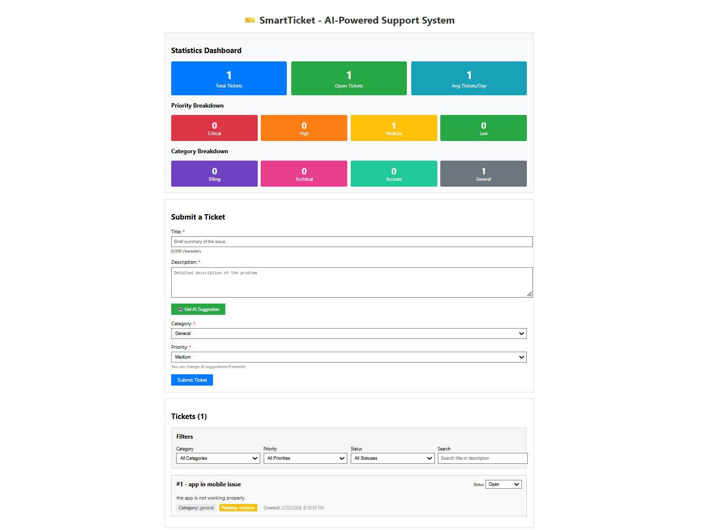
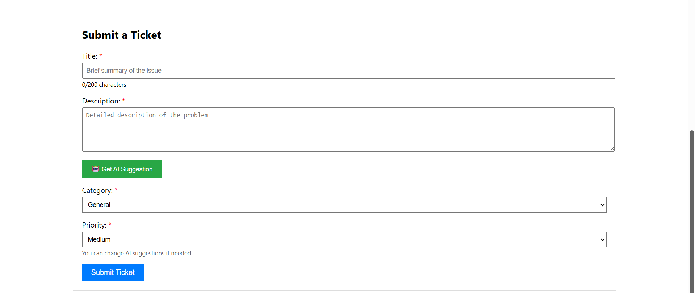
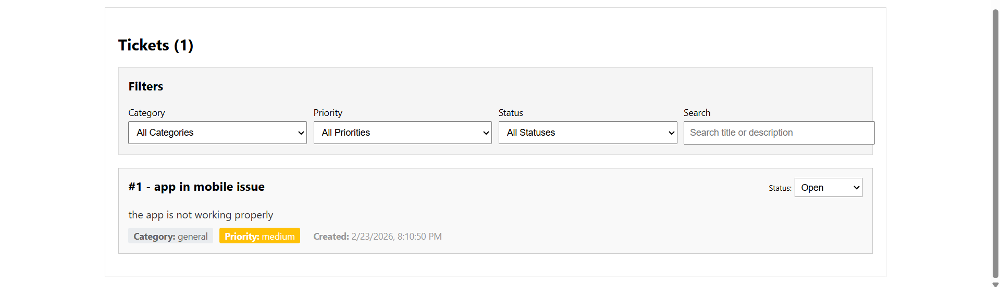
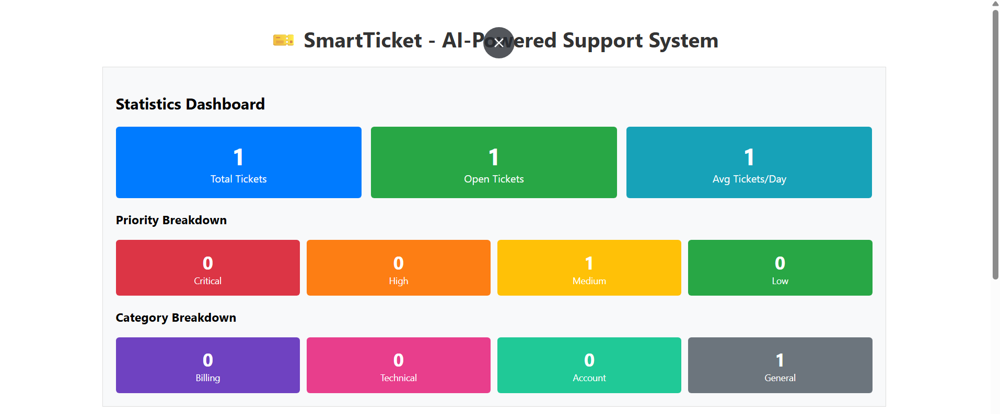

# SmartTicket - AI-Powered Support Ticket System

An intelligent support ticket management system with automatic categorization using AI (Google Gemini).


## ✨ Features at a Glance

<table>
  <tr>
    <td width="50%">
      
      <p align="center"><b>Stats Dashboard</b></p>
    </td>
    <td width="50%">
      
      <p align="center"><b>AI-Powered Classification</b></p>
    </td>
  </tr>
  <tr>
    <td width="50%">
      
      <p align="center"><b>Advanced Filtering</b></p>
    </td>
    <td width="50%">
      
      <p align="center"><b>Real-Time Analytics</b></p>
    </td>
  </tr>
</table>


## Tech Stack
- **Backend:** Django 5.0 + Django REST Framework + PostgreSQL
- **Frontend:** React 18
- **LLM:** Google Gemini 1.5 Flash
- **Infrastructure:** Docker + Docker Compose

## Features
- ✅ Automatic ticket categorization using AI
- ✅ Priority suggestion based on ticket description
- ✅ Real-time statistics dashboard
- ✅ Advanced filtering and search
- ✅ Status management workflow
- ✅ Database-level aggregation for stats

## Prerequisites
- Docker Desktop installed and running
- Google Gemini API key ([Get one free](https://ai.google.dev/))

## Quick Start

### 1. Extract the project
```bash
unzip ChiragJogi_Assessment.zip
cd SmartTicket
```

### 2. Configure API Key

**IMPORTANT:** You need a Google Gemini API key to use the AI classification feature.

**Get a free API key:**
1. Go to https://ai.google.dev/
2. Click "Get API Key"
3. Sign in with Google account
4. Create new API key
5. Copy the key (starts with `AIzaSy...`)

**Add your API key:**

Copy the example file to create your `.env`:
```bash
cp .env.example .env
```

**On Windows:**
```bash
copy .env.example .env
```

Then edit `.env` and replace `your_api_key_here` with your actual API key:
```env
GEMINI_API_KEY=AIzaSyXXXXXXXXXXXXXXXXXXXXXXXXXX
```

### 3. Start the application
```bash
docker-compose up --build
```

Wait for all services to start (5-10 minutes first time).

### 4. Access the application
- **Frontend:** http://localhost:3000
- **Backend API:** http://localhost:8000/api/tickets/
- **Admin Panel:** http://localhost:8000/admin

**Note:** Without a valid API key, the AI suggestion feature will show an error, but you can still create tickets manually.

### 5. Create admin user (optional)

The Django admin panel is available but not required for core functionality.

To create an admin user:
```bash
docker exec -it smartticket_backend python manage.py createsuperuser
```
Follow the prompts:
- Username: (your choice, e.g., admin)
- Email: (your choice, e.g., admin@example.com)
- Password: (your choice)
- Password confirmation: (same password)

Then access the admin panel at: http://localhost:8000/admin

## API Endpoints

| Method | Endpoint | Description |
|--------|----------|-------------|
| POST | `/api/tickets/` | Create a new ticket |
| GET | `/api/tickets/` | List all tickets (supports filters) |
| PATCH | `/api/tickets/<id>/` | Update ticket |
| GET | `/api/tickets/stats/` | Get aggregated statistics |
| POST | `/api/tickets/classify/` | AI classification endpoint |

### Filters (GET /api/tickets/)
- `?category=billing` - Filter by category
- `?priority=high` - Filter by priority
- `?status=open` - Filter by status
- `?search=keyword` - Search title and description

Multiple filters can be combined.

## Architecture

### Backend (Django)
- RESTful API using Django REST Framework
- PostgreSQL for data persistence
- Google Gemini API for ticket classification
- Database-level aggregation for statistics

### Frontend (React)
- Single-page application
- Axios for API communication
- Real-time updates without page refresh
- Responsive design

### Database Schema
```
Ticket Model:
- id (Primary Key)
- title (CharField, max_length=200)
- description (TextField)
- category (CharField with choices)
- priority (CharField with choices)
- status (CharField with choices, default='open')
- created_at (DateTimeField, auto_now_add=True)
```

## Design Decisions

### Why Google Gemini?
- Free tier with 1500 requests/day
- Fast response time (1-2 seconds)
- Excellent at classification tasks
- No credit card required

### Why Database-Level Aggregation?
Per assessment requirements, stats use Django ORM's `aggregate()` and `annotate()` instead of Python loops for better performance and scalability.

### Why Docker?
- Consistent environment across machines
- Easy setup for reviewers
- Production-ready deployment
- Isolates dependencies

## Development

### Run without Docker (local development)

**Backend:**
```bash
python -m venv venv
venv\Scripts\activate
pip install -r requirements.txt
python manage.py migrate
python manage.py runserver
```

**Frontend:**
```bash
cd frontend
npm install
npm start
```

## Stopping the Application
```bash
docker-compose down
```

To remove volumes (clears database):
```bash
docker-compose down -v
```

## Author
Built as a technical assessment project demonstrating full-stack development with AI integration.
